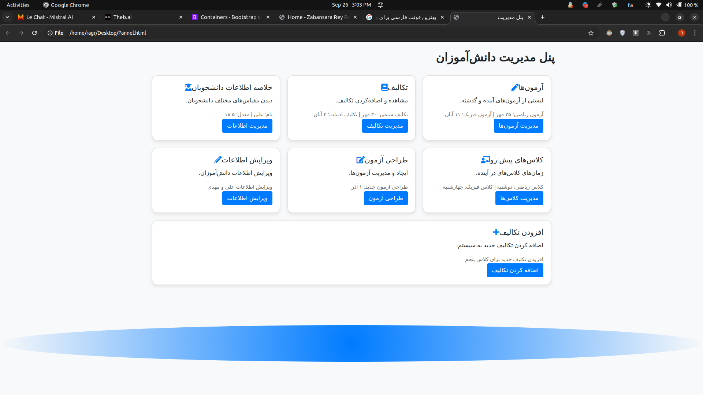
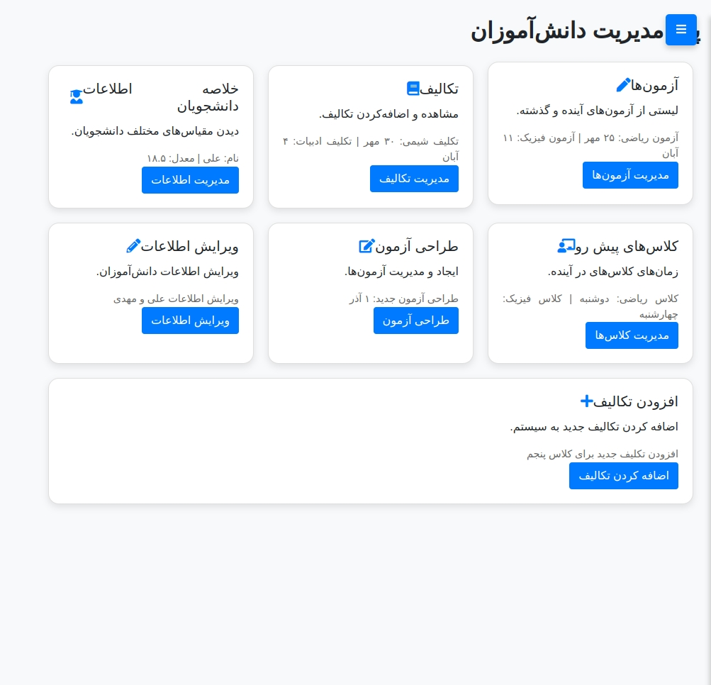
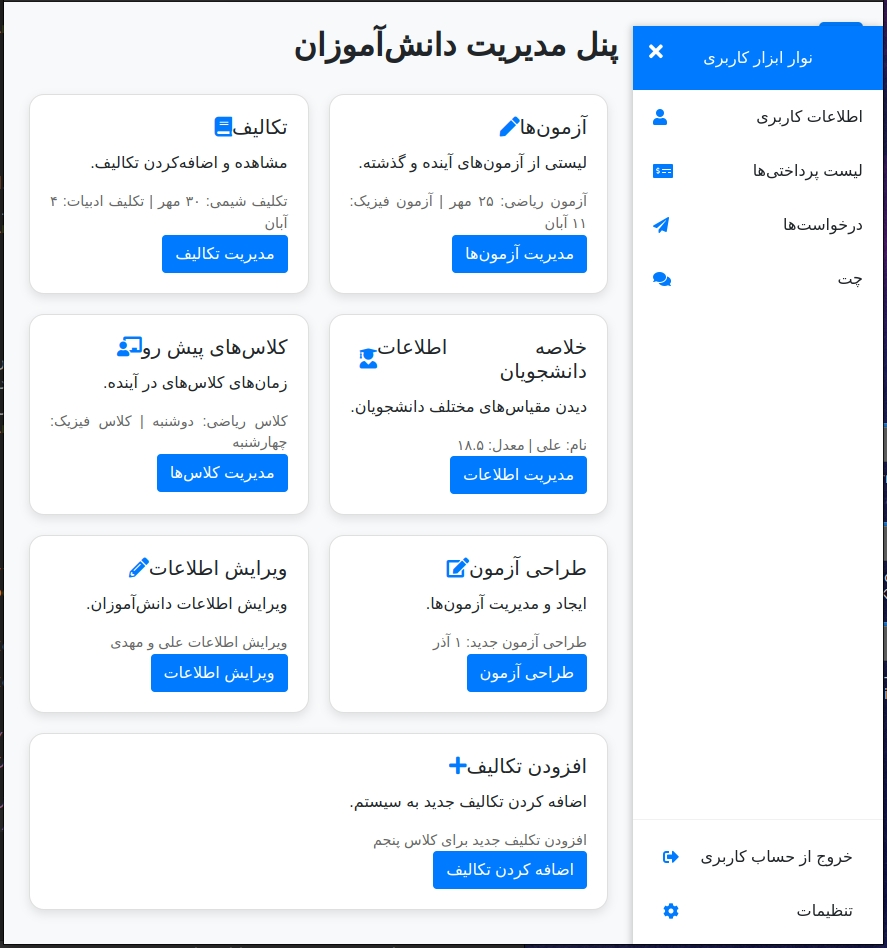
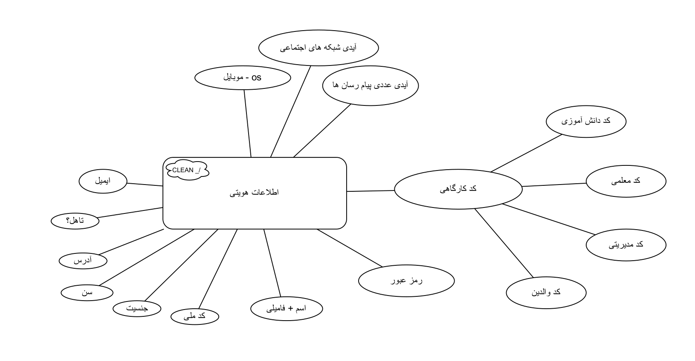

# 🏫 Zabansara Language Education System — Django Academy Manager

> A complete **web-based platform** for managing language schools and academies, built with **Django**.  
> Features a responsive **dashboard**, **role-based system**, and smart student management tools to simplify teaching, communication, and evaluation.

---

## 🌟 Overview

**Zabansara Language Education System** is a modular **Django-based management platform** developed to digitalize and automate academic workflows in language institutes.  
It provides an intuitive dashboard for teachers, administrators, and students — enabling them to manage classes, exams, homework, and communication from a single hub.

Originally created for **Zabansara Language Academy**, this project represents a scalable foundation for **modern LMS (Learning Management Systems)**, easily adaptable to other academies or private institutions.

---

## 🚀 Key Features

| Feature | Description |
|----------|-------------|
| 🧑‍🏫 **Multi-Role System** | Separate dashboards and permissions for students, teachers, and administrators. |
| 🧾 **Homework & Assignments** | Create, edit, and monitor student tasks in real-time. |
| 🧮 **Exams & Results** | Design, manage, and view past/future exams with analytics. |
| 📅 **Class Scheduling** | Organize future classes and display weekly timetables. |
| 📈 **Performance Dashboard** | View summaries, averages, and attendance analytics instantly. |
| 🛠️ **Information Management** | Edit and update student data dynamically with form validation. |
| 💬 **Communication Tools** | Add chat, notifications, and class discussions (future-ready). |
| 💻 **Responsive UI** | Clean interface built with **Bootstrap 5** and **Django templates**, fully mobile-friendly. |
| 🔐 **Authentication System** | User login/logout flow with Django sessions and secure role-based access. |

---

## 🧩 Technology Stack

- **Backend:** Django 4.x (Python)
- **Frontend:** Bootstrap 5, HTML, CSS, JS
- **Database:** SQLite (dev) / PostgreSQL (production)
- **Template Engine:** Django Templating System
- **Deployment Ready:** Configurable for Linux servers (Nginx/Gunicorn)
- **Version Control:** GitHub

---

## ⚙️ Installation Guide

1. **Clone the Repository**
   ```bash
   git clone https://github.com/RaGR/Language-Education-System---Django.git
   cd Language-Education-System---Django
``

2. **Create and Activate Virtual Environment**

   ```bash
   python -m venv venv
   source venv/bin/activate      # Linux/macOS
   venv\Scripts\activate         # Windows
   ```

3. **Install Dependencies**

   ```bash
   pip install -r requirements.txt
   ```

4. **Run Migrations**

   ```bash
   python manage.py migrate
   ```

5. **Start Development Server**

   ```bash
   python manage.py runserver
   ```

6. **Access the App**

   ```
   http://127.0.0.1:8000/
   ```

---

## 🧭 Directory Structure

```
Language-Education-System---Django/
│
├── home/                # Home views and templates
├── login/               # Authentication app
├── dashboard/           # Role-based dashboard logic
├── static/              # Static CSS, JS, and icons
├── templates/           # Shared base templates
├── images/              # Project screenshots and diagrams
├── manage.py
└── requirements.txt
```

---

## 🖼️ Visual Overview

Below are real screenshots and diagrams from the project interface.

### 🖥️ Dashboard-wide.png

A wide-screen preview of the **student management panel**, showing active modules like tasks, exams, class scheduling, and student summaries — all displayed in clean responsive cards.


---

### 📱 Dashboard-responsive.jpg

Mobile-responsive layout demonstrating how the dashboard adjusts seamlessly across devices using Bootstrap’s grid system.


---

### 🧩 Side-panel-opened.jpg

The collapsible **user sidebar** showing navigation for payment lists, requests, chats, and settings — designed for fast access and role-specific features.


---

### 🧠 database-user-ER.png

The **entity-relationship (ER) diagram** describing how student identity, parental info, course codes, and user roles interconnect inside the database schema.


---

## 🧠 System Architecture

The platform follows a **3-tier architecture**:

1. **Presentation Layer** — HTML/CSS + Bootstrap for responsive dashboards.
2. **Logic Layer** — Django Views and Models for CRUD operations.
3. **Data Layer** — SQLite/PostgreSQL database with normalized schema and referential integrity.

Each role (Admin, Teacher, Student) is authenticated through Django sessions and served customized dashboards with tailored permissions.

---

## 🧱 Future Improvements

* [ ] Integrate **Django REST Framework (DRF)** for mobile API access.
* [ ] Add **real-time chat** using WebSockets.
* [ ] Implement **Celery** for background tasks (exam result processing).
* [ ] Expand **admin analytics** with charts and performance graphs.
* [ ] Add **cloud deployment** instructions for AWS/DigitalOcean.

---

## 🤝 Contribution

Contributions and feedback are welcome!

1. Fork the repository
2. Create a feature branch (`feature/add-new-dashboard`)
3. Commit changes and open a pull request

Make sure your code follows **PEP8** and uses descriptive commits.

---

## 🧾 License

This project is licensed under the **MIT License**.
You’re free to use, modify, and distribute it for educational or commercial purposes.

---

## 👨‍💻 Developer

**Ramtin Samadi**
Back-End Developer | Django Engineer | AI Automation Enthusiast
📧 [ramtin7.samadi@gmail.com](mailto:ramtin7.samadi@gmail.com)
🔗 [LinkedIn](https://www.linkedin.com/in/ramtin-samadi-ragr7/) • [GitHub](https://github.com/RaGR)

> *Empowering education through elegant engineering.*

---

## ⭐ Support & Showcase

If you find this project useful, please **⭐ Star the repository** and share it!
It’s part of the **“Education Systems”** portfolio — showcasing advanced Django architecture for academic platforms.
